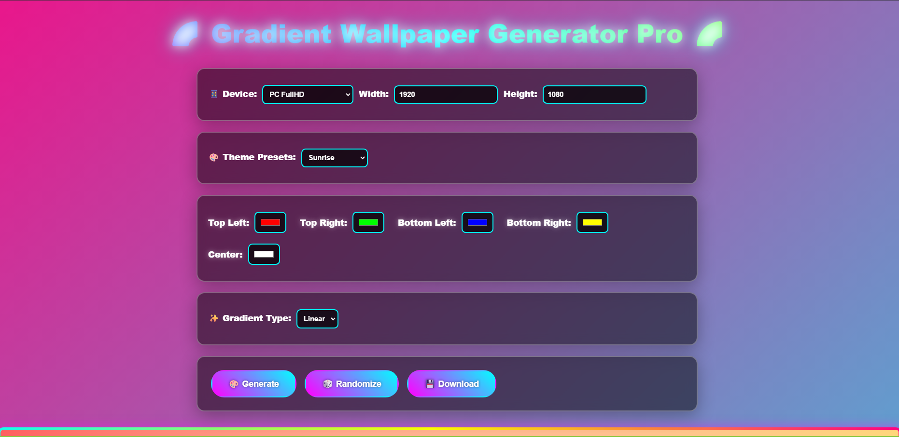

# 🌈 Gradient Wallpaper Generator Pro

A **powerful, interactive web-based gradient wallpaper creator** that lets you design stunning, high-resolution wallpapers with full control over colors, gradient types, and dimensions — perfect for desktops, phones, and tablets.

> **Live Demo**: [Open in Browser](https://snowbellsan.github.io/Gradient-Wallpaper-Generator-Pro) *(Replace with your actual GitHub Pages URL)*

---

## ✨ Features

- **4-Corner + Center Color Control** – Precisely blend colors from all corners and a customizable center point.
- **Linear & Radial Gradients** – Switch between smooth linear transitions or vibrant radial bursts.
- **Preset Themes** – Ready-to-use professional gradients:
  - Sunrise 🌅
  - Ocean Depth 🌊
  - Space 🌌
  - Forest Breath 🌲
- **Device Presets** – One-click resolutions:
  - FullHD, WQHD, 4K (PC)
  - Smartphone FullHD+
  - iPad Pro
  - Custom size input
- **Randomize Button** 🎲 – Instant inspiration with random color combos.
- **Download as PNG** 💾 – Export your masterpiece in full resolution.
- **Responsive Canvas Preview** – Real-time rendering with glowing animated borders.

---

## 🚀 How to Use

1. **Select a device preset** or enter custom width/height.
2. **Choose a theme preset** or manually pick colors using the color pickers.
3. **Switch between Linear and Radial** gradient types.
4. Click **Generate** to update the preview.
5. Hit **Randomize** for creative surprises!
6. When happy, click **Download** to save your wallpaper.

---

## 🛠️ Tech Stack

- **HTML5 Canvas** – Pixel-perfect gradient rendering
- **Vanilla JavaScript** – No frameworks, lightweight & fast
- **CSS Animations** – Animated background, glowing effects, floating title
- **Responsive Design** – Works on all devices

---

## 🎨 Gradient Algorithms

### Linear Mode
- Bilinear interpolation between four corners
- Blended with center color based on distance from canvas center

### Radial Mode
- Distance-based fade from center to edge
- Edge colors interpolated by angle (smooth 360° color wheel)
- Power curve (`dist^1.5`) for enhanced center focus

---

## 📱 Supported Resolutions

| Device        | Resolution     |
|---------------|----------------|
| PC FullHD     | 1920×1080      |
| PC WQHD       | 2560×1440      |
| PC 4K         | 3840×2160      |
| Smartphone    | 1080×2400      |
| iPad Pro      | 2732×2048      |
| **Custom**    | Any size       |

---

## 🚀 Deployment (GitHub Pages)

1. Push this repo to GitHub
2. Go to **Settings > Pages**
3. Set branch to `main` and folder to `/root`
4. Your site will be live at:  
   `https://snowbellsan.github.io/Gradient-Wallpaper-Generator-Pro`

---

## 🤝 Contributing

Contributions are welcome! Feel free to:

- Add new preset themes
- Improve gradient algorithms
- Add noise, patterns, or textures
- Enhance UI/UX

Just fork, modify, and submit a pull request.

---

## 📄 License

[MIT License](LICENSE) – Free to use, modify, and distribute.

---

## Author

**Jack**    ( https://x.com/Jackpot_jack )  
*Simulator Archaeologist | AI Conductor | One-sentence Philosopher*

---

---

**Made with ❤️ and gradients**  
*Turn colors into art — one pixel at a time.*
